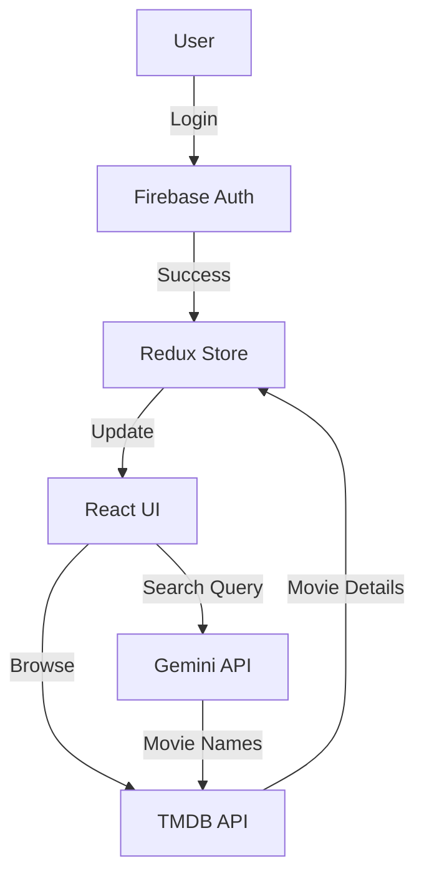

# Netflix GPT 🎬🤖


> A modern Netflix clone with **AI-powered movie search**, built using React, Redux Toolkit, and Firebase.

## 🚀 Overview

**Netflix GPT** is a feature-rich Single Page Application (SPA) that mimics the Netflix user experience. It goes beyond a simple clone by integrating **Google's Gemini AI** to provide an intelligent movie recommendation system. Users can search for movies using natural language (e.g., "Funny 90s action movies"), and the app will suggest relevant titles fetched from the **TMDB Database**.

## 🛠️ Tech Stack

| Category | Technology |
|----------|------------|
| **Frontend** | React 19, Vite |
| **Styling** | Tailwind CSS (Responsive Design) |
| **State Management** | Redux Toolkit (Slices for User, Movies, GPT, Config) |
| **Routing** | React Router DOM |
| **Authentication** | Firebase Auth (Email/Password) |
| **AI Integration** | Google Gemini 2.0 Flash API |
| **Movie Data** | TMDB API |

## ✨ Features

- **🔐 Authentication**:
  - Secure Sign Up & Sign In using Firebase.
  - Form validation with robust error handling (using `useRef` for performance).
  - Protected routes (redirects to Login if not authenticated).

- **🎥 Browse / Streaming Experience**:
  - **Main Container**: Dynamic video background (autoplay/mute) just like the real Netflix.
  - **Secondary Container**: Horizontal scrolling lists for "Now Playing", "Popular", "Top Rated", and "Upcoming" movies.
  - **Dynamic Hooks**: Custom hooks to fetch and manage data efficiently.

- **🤖 AI-Powered Search (GPT)**:
  - Integration with **Gemini AI** to interpret natural language queries.
  - Fetches movie details from TMDB based on AI recommendations.
  - Multi-language support (English, Hindi, Spanish) for the search interface.

## 🏗️ Architecture

The application follows a clean component-based architecture with Redux for state management.



## ⚙️ Installation & Setup

1.  **Clone the repository**
    ```bash
    git clone https://github.com/yourusername/netflix-gpt.git
    cd netflix-gpt
    ```

2.  **Install dependencies**
    ```bash
    npm install
    ```

3.  **Environment Configuration**
    Create a `.env` file in the root directory and add your keys:
    ```env
    VITE_OPENAI_API_KEY="your_google_gemini_api_key"
    ```
    *(Note: The variable is named `OPENAI_API_KEY` for legacy reasons but uses the Gemini API key).*

4.  **Run the App**
    ```bash
    npm run dev
    ```

5.  **Build for Production**
    ```bash
    npm run build
    ```

## 📂 Project Structure

```bash
src/
├── components/       # UI Components (Header, Body, Browse, Login, etc.)
├── hooks/            # Custom Hooks (useNowPlayingMovies, etc.)
├── utils/            # Helper functions, Redux Store, Slices, Constants
├── App.jsx           # Root Component
└── main.jsx          # Entry Point
```

## 🤝 Contributing

1.  Fork the Project
2.  Create your Feature Branch (`git checkout -b feature/AmazingFeature`)
3.  Commit your Changes (`git commit -m 'Add some AmazingFeature'`)
4.  Push to the Branch (`git push origin feature/AmazingFeature`)
5.  Open a Pull Request

---
*Disclaimer: This project is for educational purposes only. All movie data is provided by TMDB.*
